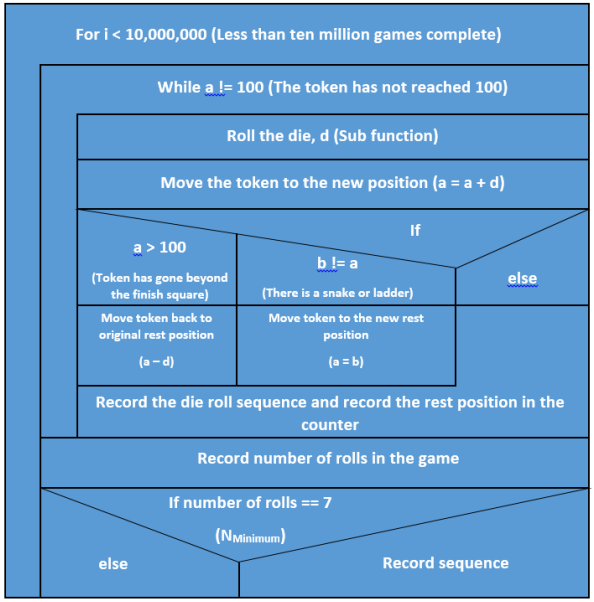

# Snakes and Ladders Sim
Simulation of a snakes and ladders board in C as a univerity course work, March 2014.

The program simulates 10 million games of snakes and ladders. This number of games is sufficient to have a broad range of results for meaningful statistics. The program has been written to conform to the rules below, which have been taken from the assignment document:

## Rules of the Game
1. The token must start off the board and make its way to square 100 on the board.
2. 1 die is rolled at the beginning of each turn.
3. The token is moved the number of squares sequentially as indicated by the number shown 
on the die.
4. If the token lands on a square at the bottom of a ladder, the token is moved to the top of 
the ladder.
5. If the token lands on a square containing the head of a snake, the token is moved down the 
snake to the square containing its tail.
6. If the token is on squares 99, 97, 96 or 94, the exact die roll is required to get to 100. If the 
value of the token after the die roll exceeds 100, the token is not moved and remains where 
it was last at rest. 

## The program
The program consists of the main program within the main and several sub-programs which perform the statistics calculations and the die roll. The variables which store the values required to perform the statistical analysis are stored as global functions.

Below is a Nassi Schneidermann diagram representation of the main algorithm.
	

## Statistics
This software collects and outputs the following statistics into a txt file.

| Variable | Description |
| ---------- | ---------- |
| pL | Probablility of resting on the least common rest square |
| pC | Probability of resting on the most common rest square | 
| moRolls | The mode number of rolls to complete a game | 
| meRolls | The mean number of rolls to complete a game |
| nUnique | The number of unique roll sequences to complete the game in 7 rolls |
| dieRand | Records frequency of roll die. Each location represents a dice value |

